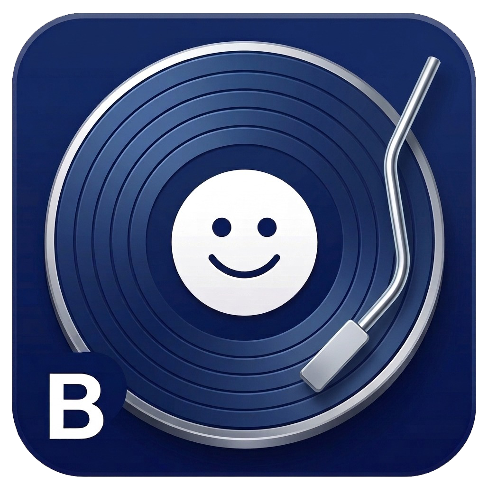

  

  

  # Lado B
 
 
 

---

  
# Visão geral :

Este repositório é dedicado à disciplina de Desenvolvimento de Sistemas de Informação (BSI/UFRPE). O **Lado B** é um aplicativo mobile voltado a recomendação personalizada de obras musicais, registro, avaliação e análise crítica de produções musicais. A proposta estimula o debate sobre essas obras e desenvolve uma comunidade colaborativa.

---

# Equipe e orientação :

**Docentes Orientadores:** Prof. Dr. Gabriel Alves de Albuquerque Júnior; Profa. Dra. Maria da Conceição Moraes Batista.

**Discentes:** João Pedro Leite, Larissa de Souza Galindo, Luiz Filipe Feitosa.

---
  
